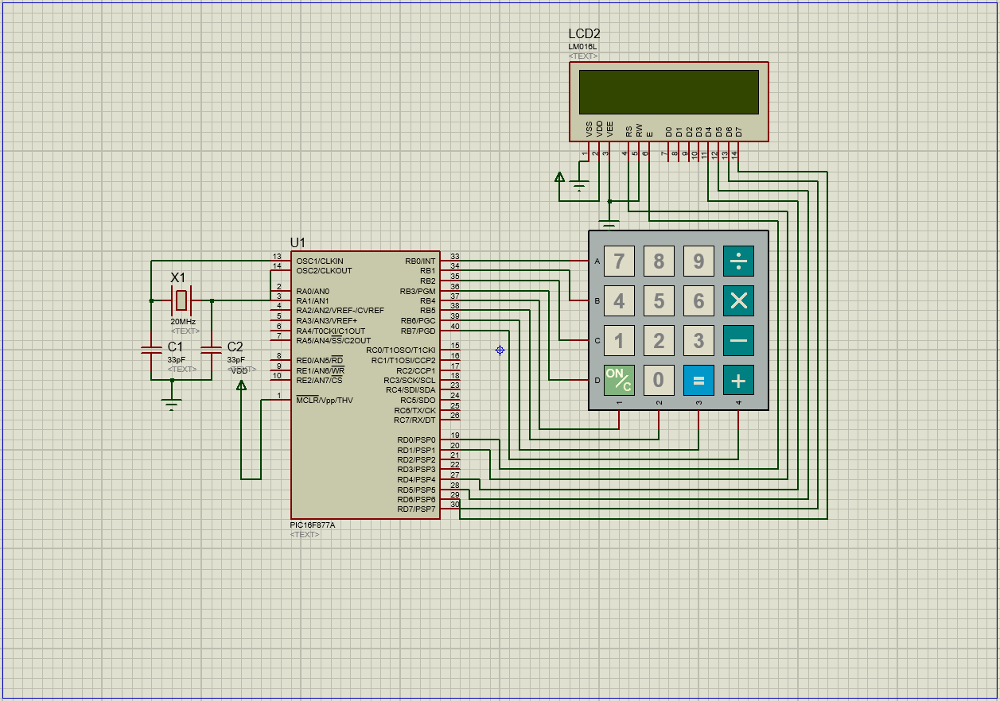

# PIC16F877A-Based-Calculator

This project is about the programming of the PIC16F877A microcontroller to be use as a calculator using MPLABX and the XC8 C compiler. Simulation of the calculator is done with Proteus.

The MpLabX project is in the [Program.X](./Program.X) folder. The Proteus simulation project is in [simulation.pdsprj](./simulation.pdsprj) file.

A schematic diagram of the simulation is shown below
